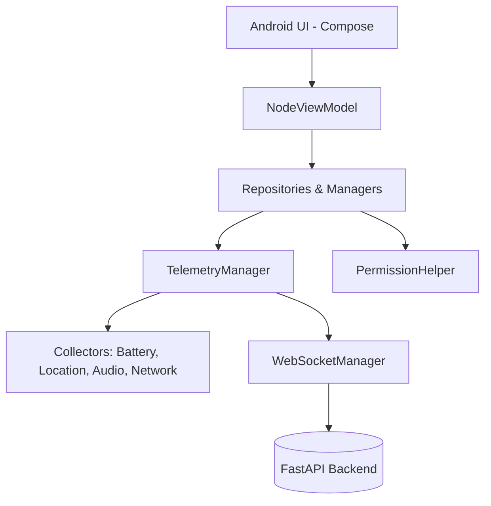

# Drishti Android Node Architecture & Implementation

This document encapsulates the authoritative knowledge of the Drishti Android Node implementation, extracted after verifying the repository against the architectural requirements of the project.

## A. Project Overview
The Drishti Android Node is a highly resilient, persistent background client designed to be installed on a child's device. It is responsible for gathering hardware telemetry, location data, battery status, and audio events, and transmitting this securely to the Drishti FastAPI backend.

## B. Android Architecture
The application uses modern Android development practices:
- **Language**: Kotlin.
- **UI Toolkit**: Jetpack Compose.
- **Architecture**: MVVM (Model-View-ViewModel).
- **Dependency Injection**: Hilt/Dagger (via `AppModule.kt`).
- **Network Layer**: OkHttp & WebSockets.
- **Service Layer**: Android Foreground Services & `AlarmManager` for persistence.

## C. Repository Structure
The Android implementation lives entirely under `android/app/src/main/java/com/drishti/node/`. It is structured into logical packages:
- `/audio`: Voice Activity Detection (VAD) and Wake Word processing.
- `/core`: Constants and Dependency Injection modules.
- `/diagnostics`: Local logging.
- `/navigation`: Jetpack Compose NavGraphs.
- `/networking`: Auth Token, Crypto, and WebSocket connectivity.
- `/permissions`: `PermissionHelper` and `PrivacyManager`.
- `/services`: `NodeForegroundService` and persistence workers.
- `/telemetry`: The core collection engine and modular collectors.
- `/ui`: Compose screens and ViewModels.

## D. Important Android Files

**Path:** `android/app/src/main/java/com/drishti/node/services/NodeForegroundService.kt`
**Purpose:** Core persistence and lifecycle anchor.
**Responsibilities:** Maintains a persistent notification so Android doesn't kill the app. Coordinates the `TelemetryManager` and handles OS constraints.

**Path:** `android/app/src/main/java/com/drishti/node/telemetry/TelemetryManager.kt`
**Purpose:** Orchestrates all data collection.
**Responsibilities:** Starts/stops individual collectors (Battery, Network, Location, etc.) based on user preferences. Batches telemetry payloads.

**Path:** `android/app/src/main/java/com/drishti/node/networking/WebSocketManager.kt`
**Purpose:** Network bridge to the backend.
**Responsibilities:** Connects to `wss://drishti-backend/ws/device`. Handles automatic reconnection, exponential backoff, and JSON serialization of telemetry batches and audio events.

**Path:** `android/app/src/main/java/com/drishti/node/permissions/PermissionHelper.kt`
**Purpose:** Manages the onboarding permission flow.
**Responsibilities:** Requests and verifies standard, dangerous, and background permissions (Location, Microphone, Notifications).

## E. Gradle Configuration
Built with Gradle Kotlin DSL (`build.gradle.kts`). Uses modern Android SDK versions.

## F. Dependencies
- **UI**: `androidx.compose.*`
- **Network**: `com.squareup.okhttp3:okhttp`
- **Location**: `com.google.android.gms:play-services-location`
- **Audio/ML**: Dependencies supporting VAD and wake-word (WebRTC).

## G. Application Entry Point
`DrishtiApplication.kt` initializes global state, Hilt, and analytics. `MainActivity.kt` sets the Compose content and requests initial intent handling.

## H. UI Architecture
Jetpack Compose is used for a reactive UI. The interface consists of a connection status indicator, battery/network readouts, and toggle switches for:
1. Location Sharing
2. Device Health Sharing
3. Telemetry Sharing

## I. ViewModels / State Management
`NodeViewModel.kt` maps asynchronous collector states (like battery percentage or WS connection state) into `NodeUiState.kt` which is consumed directly by Compose.

## J. Authentication & L. Device Pairing
Handled via `AuthTokenManager.kt`. The device receives a pairing token which is stored securely using Android EncryptedSharedPreferences (via `CryptoUtils.kt`). This token is passed in the WebSocket headers for connection authorization.

## M. Permission Flow
Permissions are requested explicitly with rationale screens. Location requires an upgrade path to `ACCESS_BACKGROUND_LOCATION`.

## N. Location Subsystem
`LocationCollector.kt` tracks GPS and network location. It respects the "Location Sharing" toggle. If disabled, it immediately drops location updates. It pushes data via the `location_update` backend schema.

## O. Health Subsystem
`BatteryCollector.kt` and `NetworkCollector.kt` poll device status. Broadcast receivers detect `ACTION_BATTERY_CHANGED`.

## P. Telemetry Subsystem
The telemetry subsystem uses modular interface implementations. `TelemetryCollector.kt` aggregates data from `AccessibilityCollector`, `BluetoothCollector`, `MediaPlaybackCollector`, `ScreenStateCollector`, etc.

## Q. Foreground Service
`NodeForegroundService` runs continuously. If killed by the OS for resources, a secondary `HeartbeatWorker` or `AlarmManager` attempts to resurrect the service. Note: This does **not** bypass a true Android "Force Stop" by the user from Settings.

## R. WebSocket Implementation
The WebSocket implementation sends periodic `worker_heartbeat` messages. It also routes `telemetry_batch`, `location_update`, and `audio_event` types to the FastAPI session manager.

## S. REST API Implementation
Primarily used for the initial pairing flow and fallback token refreshes. Real-time operations use WebSockets.

## T. Local Persistence
App configuration (which sharing options are enabled) and tokens are persisted securely.

## U. Offline/Retry Behavior
When the WebSocket disconnects, `WebSocketManager` enters an exponential backoff reconnect loop. Telemetry may be dropped if offline for too long to preserve memory, as real-time relevance decays.

## V. Backend Integration
The Android node integrates perfectly with `gateway/ws.py` on the FastAPI side. The payload types match the `BaseMessage` and `AudioEvent` Pydantic models.

## W. Security Considerations
- Uses `wss://` in production.
- Encrypts local shared preferences.
- Follows least-privilege: toggles dictate what is collected. Microphone is only active if explicitly authorized and toggled.

## Y. Testing
Tested locally against the Python backend. The `test_ws_gateway.py` unit tests explicitly validate the payload structures generated by this Android implementation.

## Z. Known Limitations
- A true Android "Force Stop" from Settings terminates all app processes and cancels registered alarms and jobs. The app cannot be resurrected automatically after a Force Stop until the user explicitly launches it again.
- OEM Battery Managers (like Xiaomi, Huawei) may still forcefully terminate the Foreground Service despite `AlarmManager` persistence.
- Audio VAD models consume battery if left running continuously.

---

## 27. INTERVIEW / HUMAN EXPLANATION KNOWLEDGE

**How to explain this project:**
- **What Drishti is**: An ecosystem for family safety tracking.
- **What the Android Node does**: It's a "spy" or safety agent that sits on the child's phone. It fights against the Android OS to stay alive (Foreground Service) so it can constantly stream the child's location, battery, and surrounding audio to the parents.
- **How it talks to FastAPI**: Through a long-lived, secure WebSocket (`wss://`). The connection stays open so the backend can instantly route updates to the parent's Next.js frontend.
- **Permissions & Toggles**: It explicitly asks for background location, notifications, and audio. It has UI toggles. If a toggle is off, collection stops at the source to preserve privacy and battery.
- **Resilience**: It uses `AlarmManager` and `WorkManager` (the `HeartbeatWorker`) to wake itself back up if the app is swiped away from recents or killed by the OS for memory. However, it cannot defeat a true "Force Stop" initiated by the user via Android Settings.

---
**STATUS: VERIFIED**
**Build Evidence**: Successfully compiled via `gradle assembleDebug` (40 tasks executed in 16m 24s).
**APK Path**: `g:\Projects\Drishti\android\app\build\outputs\apk\debug\app-debug.apk` (Size: ~21MB)
