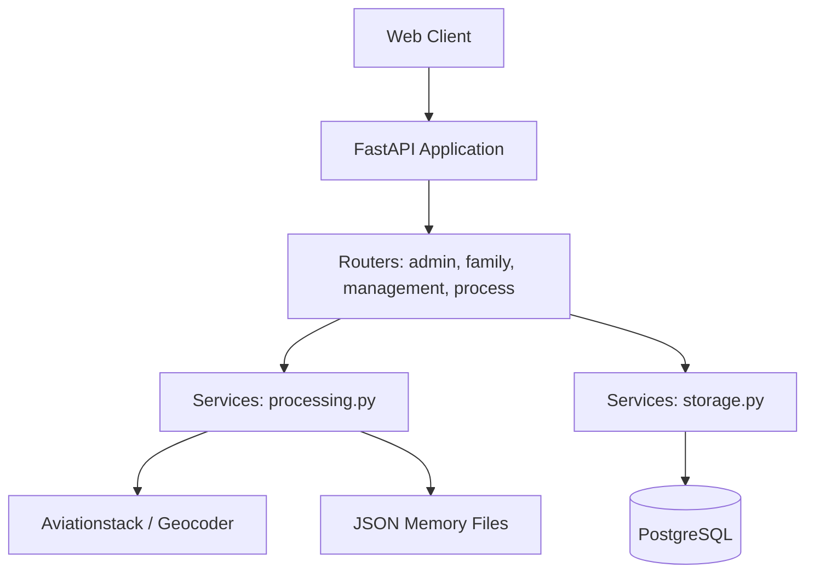
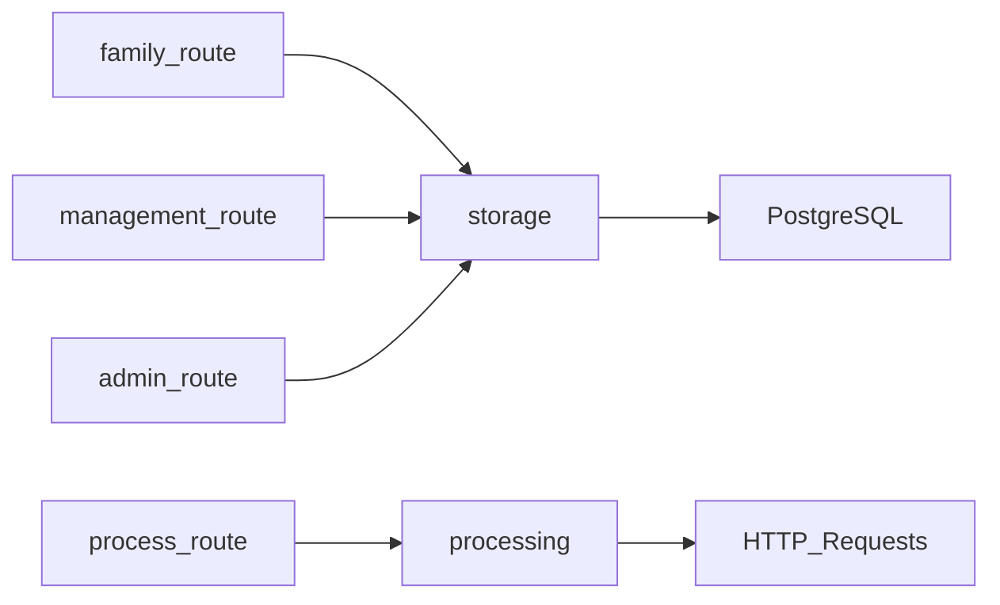
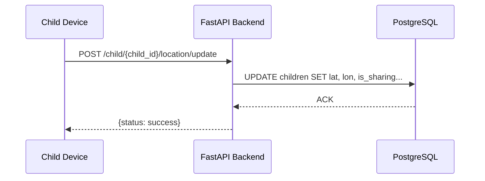

---\ntitle: architecture-summary
type: document
created: '2026-06-12T08:41:38Z'
vault: Drishti
tags:
- drishti
related: []
---\n\n# Architecture Summary: Drishti

## 1. Backend Architecture Map
The current Drishti backend is a synchronous, monolithic REST API built with FastAPI. It handles routing, logic, and database persistence in a single application.

## 2. Identified Systems

- **Memory Systems**: Persistent memory is stored in PostgreSQL (tables: `parents`, `children`). Transitory/Session memory is stored in local JSON files (`trip_info.json`, `trip_log.json`, `session_log.json`) and manipulated via `processing.py`.
- **Agent Runtime**: A basic background loop (`time_based_status_loop`) in `processing.py` periodically updates flight states based on time.
- **Websocket/Event Systems**: Currently non-existent. The system relies entirely on synchronous HTTP requests (polling) to update state.
- **Auth Systems**: Password-based authentication utilizing SHA256 hashing. Parent-child relationships are linked using randomly generated 6-character short codes. Guest sharing is supported via expiring UUID tokens. Admin functions are guarded by a hardcoded environment variable (`ROOT_PASSWORD`).
- **Plugin/Service Patterns**: Hardcoded integrations to external services (Nominatim for geocoding, Aviationstack for flight data verification). No generalized plugin system exists.
- **Context Ingestion Flow**: Telemetry is ingested synchronously via REST endpoints (`/child/location/update`, `/log-location`). Validation and storage happen inline within the route handlers and `storage.py`.
- **Persistence/Database Layers**: Uses raw `psycopg2` SQL queries against a PostgreSQL database (likely Supabase) for primary user and trip state data.

## 3. Service Dependency Graph

## 4. Event Flow Map (Current Telemetry Ingestion)

## 5. Extension Points for Device Integration
To support the Android Node architecture described in the Phase D1 plan, the following extension points must be created:
1. **Device Gateway**: Introduce an asynchronous WebSocket router (e.g., `/ws/device/{device_id}`) alongside the REST API to handle real-time, bi-directional telemetry.
2. **Device Domain Model**: Extend `schema.py` and PostgreSQL database to track discrete "Device" entities, decoupled from "Child" entities, supporting capabilities, presence state, and heartbeat logs.
3. **Event Bus / State Cache**: Implement a transient memory store (like Redis) or an internal async pub/sub system to decouple incoming telemetry from heavy database writes.
4. **Command Dispatcher**: Create an outbound command queue (stored in DB or Redis) that the WebSocket gateway pulls from to send actions to the Android device.\n\n---\n\n## Related Documents\nNone\n\n## Referenced By\nNone\n