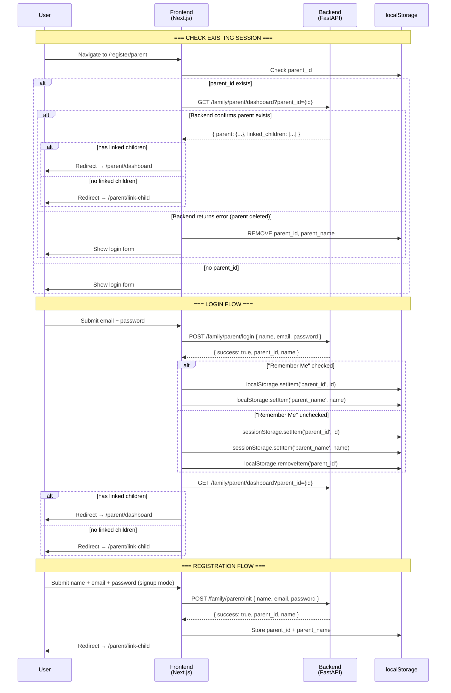
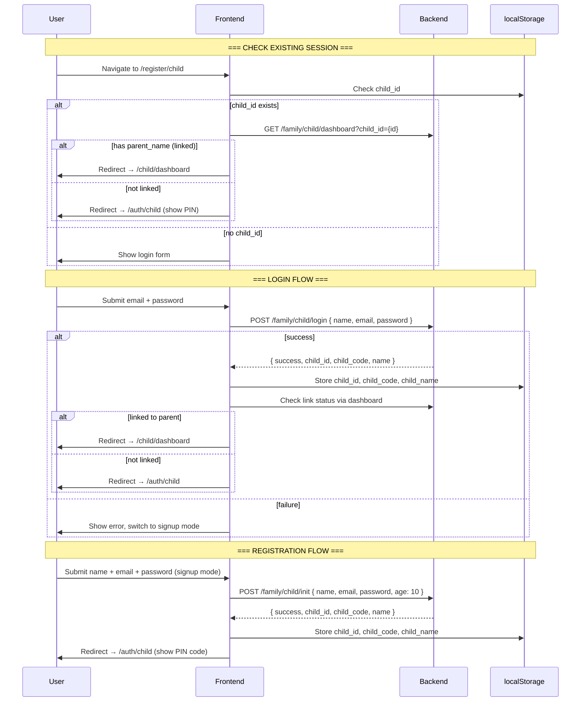

# Drishti Authentication Lifecycle

> Complete analysis of the frontend authentication flow, session handling, and persistence mechanisms.

---

## 1. Authentication Model Summary

| Aspect | Implementation |
|---|---|
| **Auth Type** | Session-ID based (no JWT, no tokens for family routes) |
| **Session Storage** | `localStorage` / `sessionStorage` (browser Web Storage API) |
| **Server-Side Auth** | None for family routes — ID passed as query parameter |
| **Token Auth** | Only for device gateway (WebSocket `token` query param) |
| **Password Handling** | Plaintext comparison (no hashing in current implementation) |
| **CORS** | `*` wildcard (or configured via `CORS_ORIGINS` env var) |

> [!WARNING]
> **Critical Security Gap:** Passwords are stored and compared in plaintext. No JWT or session tokens are used — only raw entity IDs. This is a development-stage implementation.

---

## 2. Parent Authentication Flow



---

## 3. Child Authentication Flow



---

## 4. Session Persistence Strategy

### Storage Keys

| Key | Storage | Role | Written By |
|---|---|---|---|
| `parent_id` | localStorage OR sessionStorage | Parent session identifier | `/register/parent` |
| `parent_name` | localStorage OR sessionStorage | Display name | `/register/parent` |
| `child_id` | localStorage OR sessionStorage | Child session identifier | `/register/child` |
| `child_code` | localStorage OR sessionStorage | 6-char linking code | `/register/child` |
| `child_name` | localStorage OR sessionStorage | Display name | `/register/child` |
| `drishti.backendUrl` | localStorage | Custom backend URL override | Settings panel |

### "Remember Me" Behavior

| Checkbox State | Primary Storage | Secondary Action |
|---|---|---|
| ✅ Checked (default) | `localStorage` | Persists across browser sessions |
| ⬜ Unchecked | `sessionStorage` | Clear localStorage counterparts |

### Session Validation Pattern

Every protected page follows the same pattern on mount:
1. Read `{role}_id` from `localStorage` → fallback to `sessionStorage`
2. Call the dashboard endpoint to validate the ID still exists in backend
3. If valid → proceed or redirect based on state
4. If invalid → clear all stored keys → redirect to `/register/{role}`

### Stale Session Handling

```
// Pattern used across all pages:
fetch(`${API_URL}/family/{role}/dashboard?{role}_id=${id}`)
  .then(res => {
    if (!res.ok) throw new Error('not found');
    return res.json();
  })
  .then(data => {
    if (!data.parent) {
      // Session stale — clear everything
      localStorage.removeItem('parent_id');
      localStorage.removeItem('parent_name');
      sessionStorage.removeItem('parent_id');
      sessionStorage.removeItem('parent_name');
      // Redirect to registration
    }
  })
  .catch(() => {
    // Backend unreachable — clear session
  });
```

---

## 5. No Refresh Token / JWT System

| Feature | Status |
|---|---|
| JWT Access Token | ❌ Not implemented |
| Refresh Token | ❌ Not implemented |
| Token Expiry | ❌ Not applicable |
| HTTP-Only Cookies | ❌ Not used |
| Bearer Auth Header | ❌ Not used (family routes) |
| CSRF Protection | ❌ Not implemented |

### Authentication is ID-Based

- The "auth" is simply knowing the `parent_id` or `child_id` UUID
- These IDs are passed as **query parameters** (not headers)
- No server-side session store — the backend validates by looking up the ID in its data store
- Anyone with the UUID can access the dashboard (no secrets required beyond the ID)

---

## 6. Logout Behavior

There is **no explicit logout endpoint or button** in the current frontend. Sessions are cleared only when:
1. Backend validation fails (entity deleted from DB)
2. Backend is unreachable and stale session detected
3. Manual browser storage clear

---

## 7. Device/Gateway Authentication (Separate System)

The device gateway uses a **separate, token-based** authentication system:

| Aspect | Implementation |
|---|---|
| Token Source | Hardcoded map: `{ "dev-token-123": "device_1", ... }` |
| Transport | WebSocket query parameter: `?token=xxx` |
| Validation | `authenticate_device(token)` → returns `device_id` or `None` |
| Failure Action | WebSocket close with code `1008` |
| Replay Protection | HMAC-SHA256 + Nonce + Timestamp (5s drift) for packet verification |

---

## 8. Android Adaptation Requirements

| Frontend Behavior | Android Equivalent |
|---|---|
| `localStorage` persist | `SharedPreferences` / `EncryptedSharedPreferences` |
| `sessionStorage` temporary | In-memory storage (ViewModel scope) |
| "Remember Me" toggle | Checkbox → decides SP vs in-memory |
| Session validation on mount | `onCreate()` / `onResume()` check |
| Query param auth (`?parent_id=X`) | Add to Retrofit `@Query` params |
| No JWT/Bearer | Match exactly — no `Authorization` header for family routes |
| Stale session → clear + redirect | Clear SP → navigate to Login Activity |
